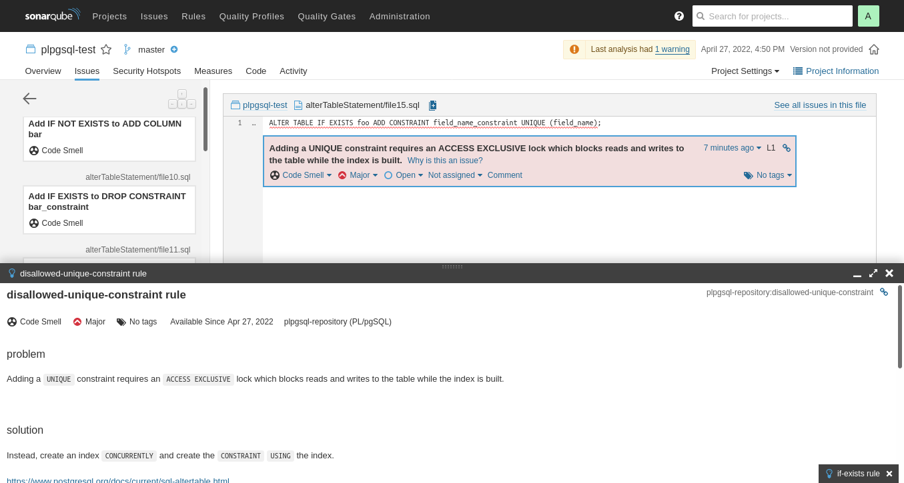

# sonar-postgres-plugin

Sonar plugin to analyze Postgres SQL scripts

## Screenshot

.

## Build

### libpg_query

This plugin uses [libpg_query](https://github.com/pganalyze/libpg_query). There are no binaries already available, so a private build is required:

```shell
git clone -o github git@github.com:pganalyze/libpg_query.git
cd libpg_query

# default compiler
make build_shared
cp libpg_query.so src/main/resources/linux-x86-64/
```

To cross-compile:
```shell
# override compiler
export CC=aarch64-linux-gnu-gcc
make build_shared
cp libpg_query.so src/main/resources/linux-armel/
```

 - [libpg_query does not support Windows](https://github.com/pganalyze/libpg_query/issues/44)

### plugin

```shell
mvn clean package
```

## Run Locally

### Sonar server

 - [Try Out SonarQube](https://docs.sonarqube.org/latest/setup/get-started-2-minutes/)
 - SonarQube will require changing the default password:
   - login: admin
   - password: admin

```shell
docker run -d --name sonarqube -e SONAR_ES_BOOTSTRAP_CHECKS_DISABLE=true -p 9000:9000 sonarqube:lts-community
docker cp target/sonar-postgres-plugin-1.0-SNAPSHOT.jar sonarqube:/opt/sonarqube/extensions/plugins/
docker restart sonarqube
xdg-open http://localhost:9000/
docker logs -f sonarqube
```

### SonarScanner for Maven

```shell
mvn sonar:sonar \
  -Dsonar.login=admin \
  -Dsonar.password=admin1 \
  -Dsonar.host.url=http://localhost:9000/
```

### SonarScanner

```shell
wget https://binaries.sonarsource.com/Distribution/sonar-scanner-cli/sonar-scanner-cli-4.7.0.2747-linux.zip
unzip sonar-scanner-cli-4.7.0.2747-linux.zip
cd sonar-scanner-4.7.0.2747-linux
bin/sonar-scanner \
  -Dsonar.login=admin \
  -Dsonar.password=admin1 \
  -Dsonar.host.url=http://localhost:9000 \
  -Dsonar.projectKey=postgres-test
```

## Acknowledgements
 * [Squawk](https://squawkhq.com/)