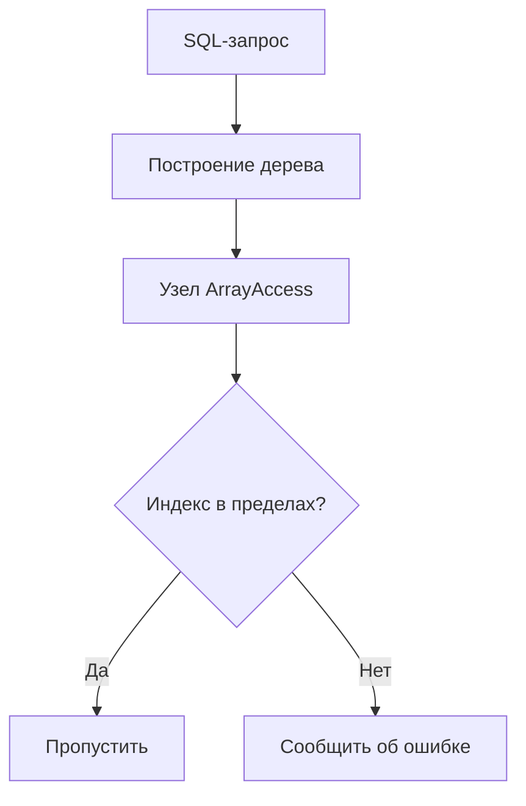

# Правило: `A_ArrayExpr.java` - Анализ массивов в PostgreSQL

## 📌 Обзор
`A_ArrayExpr.java` - ключевой компонент плагина SonarPostgres для анализа **работы с массивами** в SQL-запросах PostgreSQL. Реализован как посетитель (Visitor) ANTLR4 для выявления потенциальных проблем.

## 🔍 Основные функции
- Обнаружение выхода за границы массива
- Проверка синтаксиса конструкторов массивов
- Валидация операций сравнения массивов
- Поддержка всех операций PostgreSQL с массивами:

```sql
SELECT array[1,2,3][2];  -- Доступ по индексу
SELECT ARRAY_LENGTH(ids, 1);  -- Использование функций
```
## 🛠️ Реализация
```java
public class A_ArrayExpr extends PostgresParserBaseVisitor<Void> {
    @Override
    public Void visitArrayAccess(PostgresParser.ArrayAccessContext ctx) {
        // Проверка безопасности доступа к массиву
        checkArrayIndexSafety(ctx.index());
        return super.visitArrayAccess(ctx);
    }
    
    private void checkArrayIndexSafety(ExprContext indexExpr) {
        // Логика проверки индексов
    }
}
```

## 🚨 Обнаруживаемые проблемы
1. Выход за границы массива

 Пример SQL:

 ```sql
SELECT product_prices[10] FROM inventory 
WHERE product_id = 123;
```
**Условие**: Когда анализ показывает, что массив обычно содержит меньше 10 элементов.

**2. Смешанные типы данных**

**Пример:**

```sql
UPDATE user_settings 
SET preferences = ARRAY[1, 'admin', true]  -- Целое, строка, булево
WHERE user_id = 456;
```

**3. Неэффективные операции**

**Пример:**

```sql
SELECT * FROM large_table 
WHERE id = ANY(ARRAY(SELECT generate_series(1,1000000)));
```

## 🛡️ Настройка правила

```yaml
rules:
  postgres-array-safety:
    enabled: true
    max-index: 100
    check-type-consistency: true
```

## 💡 Рекомендации

**Безопасный доступ**
```sql
-- Вместо:
SELECT array_value[5] FROM table;

-- Используйте:
SELECT CASE WHEN array_length(array_value,1) >= 5 
       THEN array_value[5] 
       END FROM table;
```

**Типизированные массивы**

```sql
-- Вместо:
SELECT ARRAY[1,2,3];

-- Используйте:
SELECT ARRAY[1,2,3]::integer[];
```

## 🏷️ Метаданные

|Параметр|Значение
|-|-
|Ключ правила|postgres:array-safety
|Важность|Критическая
|Тип|Ошибка
|Время исправления|15 минут
|Теги|postgres, массив, производительность

## Пример анализа

**Исходный SQL**

```sql
SELECT customer_orders[10] 
FROM customers 
WHERE region_id = 5;
```

1. Обнаружение обращения *customer_orders[10]*
2. Проверка, что индекс 10 не превышает допустимый размер
3. Валидация типов данных массива
4. Формирование отчета о проблемах
