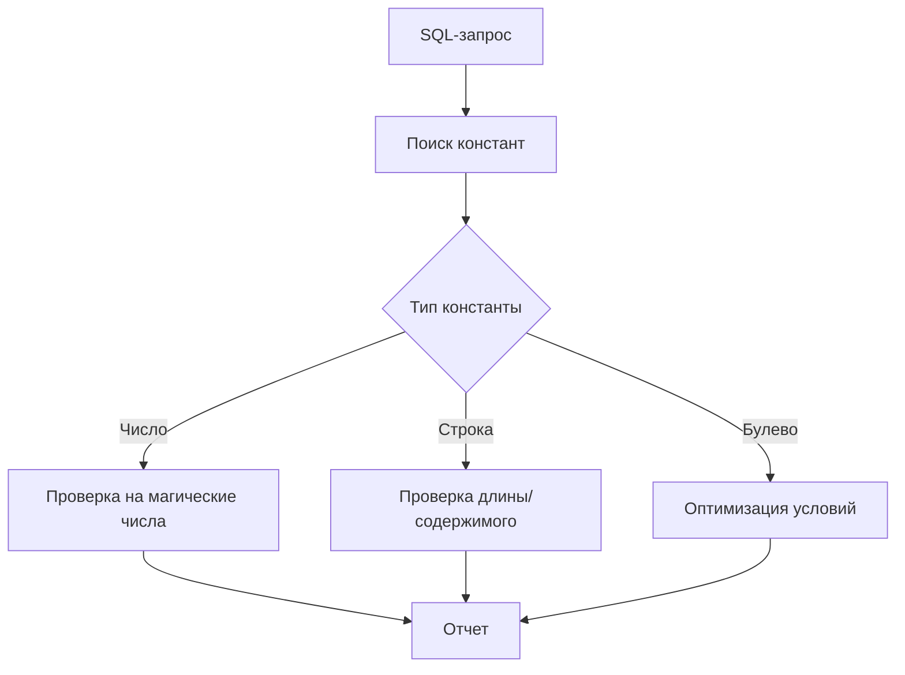

# Правило анализа константных выражений (`A_Const.java`)

## Содержание
1. [Назначение](#назначение_A_Const)
2. [Техническая реализация](#техническая-реализация_A_Const)
3. [Обнаруживаемые проблемы](#обнаруживаемые-проблемы_A_Const)
4. [Примеры SQL](#примеры-sql_A_Const)
5. [Конфигурация](#конфигурация_A_Const)
6. [Рекомендации](#рекомендации_A_Const)
7. [Метаданные](#метаданные_A_Const)

## Назначение <a name="назначение_A_Const"></a>
Анализирует константные выражения в SQL-запросах PostgreSQL для:
- Выявления "магических чисел"
- Проверки корректности литералов
- Контроля типов данных
- Оптимизации запросов

```sql
-- Примеры анализируемых конструкций
SELECT * FROM table WHERE id = 123;
UPDATE users SET role = 'admin' WHERE id = 1;
```
## Техническая реализация <a name="техническая-реализация_A_Const"></a>
**Класс-визитор ANTLR4**
```java
public class A_Const extends PostgresParserBaseVisitor<Void> {
    private static final Set<Integer> MAGIC_NUMBERS = Set.of(-1, 999999);
    
    @Override
    public Void visitA_Const(A_ConstContext ctx) {
        if (ctx.ICONST() != null) {
            checkIntegerConstant(ctx.ICONST());
        } else if (ctx.SCONST() != null) {
            checkStringConstant(ctx.SCONST());
        }
        return super.visitA_Const(ctx);
    }
    
    private void checkIntegerConstant(TerminalNode intNode) {
        int value = Integer.parseInt(intNode.getText());
        if (MAGIC_NUMBERS.contains(value)) {
            reportIssue(intNode, "Обнаружено магическое число");
        }
    }
}
```
## Обнаруживаемые проблемы <a name="обнаруживаемые-проблемы_A_Const"></a>
1. **Подозрительные числовые значения**  
Код ошибки: *CONSTANT_MAGIC_NUMBER*

Пример:
```sql
UPDATE accounts SET balance = -1 WHERE user_id = 123;
-- -1 часто используется как специальное значение
```
2. Потенциально опасные строки  
Код ошибки: *CONSTANT_UNSAFE_STRING*

Пример:
```sql
INSERT INTO config VALUES ('root', 'changeme');
-- Использование стандартных паролей
```
3. Неоптимальные булевы выражения  
  Код ошибки: *CONSTANT_REDUNDANT_BOOLEAN*  

Пример:
```sql
SELECT * FROM users WHERE deleted = false AND active = true;
-- Избыточные условия при наличии индексов
```
## Примеры SQL <a name="примеры-sql_A_Const"></a>
❌ **Проблемные запросы**
```sql
-- 1. Магическое число
DELETE FROM logs WHERE status = 999;

-- 2. Длинная строковая константа
SET description = 'Очень длинное описание...' WHERE id = 1;

-- 3. Избыточное условие
SELECT * FROM products WHERE available = true AND stock > 0;
```
✅ **Рекомендуемые исправления**
```sql
-- 1. Именованная константа
DELETE FROM logs WHERE status = STATUS_ARCHIVED;

-- 2. Вынесение в переменные
SET description = :description WHERE id = 1;

-- 3. Упрощенное условие
SELECT * FROM products WHERE stock > 0;
```
## Конфигурация <a name="конфигурация_A_Const"></a>
**Настройки в SonarQube**
```yaml
postgres:
  constants:
    magic_numbers: [-1, 0, 999, 999999]
    max_string_length: 255
    check_booleans: true
```
**Параметры анализатора**
```java
ConstantAnalyzer.newBuilder()
    .withMagicNumbers(-1, 999999)
    .withMaxStringLength(1000)
    .withBooleanChecks(true)
    .build();
```
## Рекомендации <a name="рекомендации_A_Const"></a>
1. Для числовых значений:
```sql 
-- Вместо:
WHERE status = 3;

-- Используйте:
WHERE status = STATUS_ACTIVE;
```
2. Для строковых констант:
```sql
-- Вместо:
SET role = 'administrator';

-- Лучше:
SET role = ADMIN_ROLE;
```
3. Для булевых значений:
```sql
-- Вместо:
WHERE active = true AND deleted = false;

-- Оптимальнее:
WHERE is_active AND NOT is_deleted;
```
## Метаданные <a name="метаданные_A_Const"></a>
|Свойство|Значение
|-|-
|Идентификатор|postgres:constant-analysis
|Категория|Надежность
|Время исправления|10 минут
|Теги|sql, security, performance
|Тип|Code Smell

