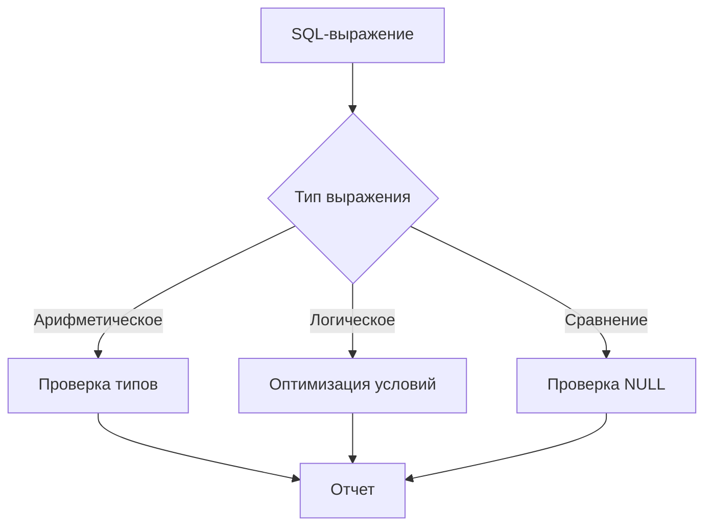

# Правило анализа константных выражений (`A_Expr.java`)

## Содержание
1. [Назначение](#назначение_A_Expr)
2. [Техническая реализация](#техническая-реализация_A_Expr)
3. [Обнаруживаемые проблемы](#обнаруживаемые-проблемы_A_Expr)
4. [Примеры SQL](#примеры-sql_A_Expr)
5. [Конфигурация](#конфигурация_A_Expr)
6. [Рекомендации](#рекомендации_A_Expr)
7. [Метаданные](#метаданные_A_Expr)
## Назначение <a name="назначение_A_Expr"></a>
Анализирует SQL-выражения в PostgreSQL для:

- Проверки корректности операторов
- Оптимизации условий WHERE/JOIN
- Обнаружения потенциальных ошибок
- Контроля типов в выражениях

```sql
-- Примеры анализируемых конструкций
SELECT * FROM table WHERE a + b > 10;
UPDATE users SET balance = balance * 1.1;
```
## Техническая реализация <a name="техническая-реализация_A_Expr"></a>
**Класс-визитор ANTLR4**

```java
public class A_Expr extends PostgresParserBaseVisitor<Void> {
    @Override
    public Void visitA_Expr(A_ExprContext ctx) {
        String operator = ctx.op.getText();
        
        // Проверка операторов
        checkOperatorCompatibility(operator, ctx.lexpr, ctx.rexpr);
        
        // Проверка NULL-условий
        if (isNullComparison(ctx)) {
            reportNullCheck(ctx);
        }
        
        return super.visitA_Expr(ctx);
    }
    
    private void checkOperatorCompatibility(String op, ParseTree left, ParseTree right) {
        Type leftType = getExpressionType(left);
        Type rightType = getExpressionType(right);
        
        if (!isCompatible(op, leftType, rightType)) {
            reportIssue(ctx, "Некорректные типы для оператора " + op);
        }
    }
}
```
## Обнаруживаемые проблемы <a name="обнаруживаемые-проблемы_A_Expr"></a>
**Некорректные операции**  
Код ошибки: `EXPR_INVALID_OPERATION`
Пример:
```sql
SELECT 'text' + 123;  -- Сложение строки с числом
```
**Неоптимальные сравнения с NULL**  
Код ошибки: `EXPR_NULL_COMPARISON`
Пример:
```sql
WHERE value = NULL;  -- Должно быть IS NULL
```
***Избыточные условия***  
Код ошибки: `EXPR_REDUNDANT_CONDITION`
Пример:
```sql
WHERE (a > 10) = true;  -- Избыточное сравнение
```
**Потенциально опасные операции**  
Код ошибки: `EXPR_DANGEROUS_OPERATION`
Пример:
```sql
WHERE 1/0 > 0;  -- Деление на ноль
```
## Примеры SQL <a name="примеры-sql_A_Expr"></a>
❌ **Проблемные запросы**
```sql
-- 1. Некорректная операция
SELECT '2023-01-01' + 10;  -- Дата + число без приведения

-- 2. Опасное деление
UPDATE stats SET ratio = a / b;  -- Возможное деление на ноль

-- 3. Избыточное условие
WHERE (active IS TRUE) = true;
```
✅ **Рекомендуемые исправления**
```sql
-- 1. Явное приведение типов
SELECT '2023-01-01'::date + INTERVAL '10 days';

-- 2. Защита от деления на ноль
UPDATE stats SET ratio = CASE WHEN b = 0 THEN 0 ELSE a / b END;

-- 3. Упрощенное условие
WHERE active IS TRUE;
```
## Конфигурация <a name="конфигурация_A_Expr"></a>
**Настройки в SonarQube**
```yaml
postgres:
  expressions:
    check_null_comparison: true
    check_division_by_zero: true
    check_type_compatibility: true
    forbidden_operations: ['~~', '!~~']  -- LIKE без экранирования
```  
**Параметры анализатора**
```java
ExpressionAnalyzer.newBuilder()
    .withNullCheck(true)
    .withDivisionByZeroCheck(true)
    .withForbiddenOperators("~~", "!~~")
    .build();
 ```
## Рекомендации <a name="рекомендации_A_Expr"></a>
Для операций с датами:

```sql
-- Вместо:
SELECT now() + '1 day';

-- Используйте:
SELECT now() + INTERVAL '1 day';
Для безопасных операций:

sql
-- Вместо:
SELECT a / b;

-- Лучше:
SELECT CASE WHEN b = 0 THEN NULL ELSE a / b END;
```
Для сравнений с NULL:
```sql
-- Вместо:
WHERE column = NULL;

-- Всегда используйте:
WHERE column IS NULL;
```
## Метаданные <a name="метаданные_A_Expr"></a>
|Свойство|Значение
|-|-
|Идентификатор|postgres:expression-analysis
|Категория|Надежность
|Время исправления|15 минут
|Теги|sql, performance, reliability
|Тип|Bug/Code Smell

Дополнительные возможности для реализации:
Проверка индексов:

```java
if (isIndexableCondition(ctx)) {
    checkIndexUsage(ctx);
}
```
Анализ производительности:

```java
if (isExpensiveOperation(ctx)) {
    reportPerformanceIssue(ctx);
}
```
Поддержка пользовательских правил:
```java
analyzer.withCustomRule(
    expr -> expr.contains("LIKE '%'") 
        ? "Неэффективный LIKE с ведущим %" 
        : null
);
```