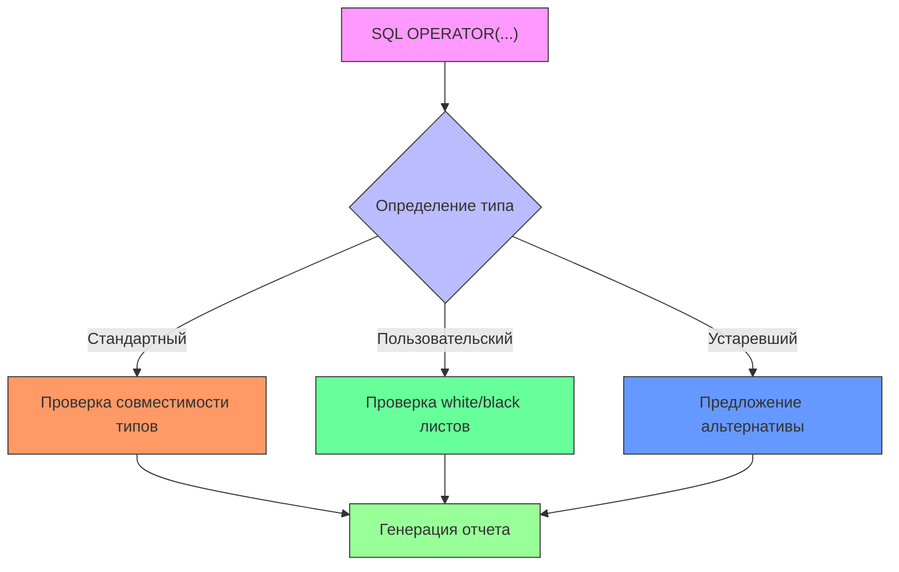

# Правило анализа типов выражений (`A_Expr_Kind.java`)

## Содержание
1. [Назначение](#назначение_A_Expr_Kind)
2. [Техническая реализация](#техническая-реализация_A_Expr_Kind)
3. [Обнаруживаемые проблемы](#обнаруживаемые-проблемы_A_Expr_Kind)
4. [Примеры SQL](#примеры-sql_A_Expr_Kind)
5. [Конфигурация](#конфигурация_A_Expr_Kind)
6. [Рекомендации](#рекомендации_A_Expr_Kind)
7. [Метаданные](#метаданные_A_Expr_Kind)

## Назначение <a name="назначение_A_Expr_Kind"></a>
Анализирует виды выражений в PostgreSQL для:
- Классификации типов операций
- Проверки допустимости комбинаций операторов
- Оптимизации выполнения запросов
- Валидации синтаксических конструкций

```sql
-- Примеры анализируемых конструкций
SELECT * WHERE a OPERATOR(pg_catalog.+) b;
UPDATE table SET x = y OPERATOR(pg_catalog.*) z;
```
## Техническая реализация <a name="техническая-реализация_A_Expr_Kind"></a>

### Класс-визитор ANTLR4

```java
public class A_Expr_Kind extends PostgresParserBaseVisitor<Void> {
    private final Map<String, ExprKindInfo> operatorKinds = loadOperatorKinds();
    
    @Override
    public Void visitA_Expr_Kind(A_Expr_KindContext ctx) {
        String operator = ctx.operator.getText();
        ExprKindInfo kindInfo = operatorKinds.get(operator);
        
        if (kindInfo == null) {
            reportIssue(ctx, "Неизвестный тип оператора: " + operator);
            return null;
        }
        
        checkOperandTypes(ctx, kindInfo);
        checkOperatorUsage(ctx, kindInfo);
        
        return super.visitA_Expr_Kind(ctx);
    }
    
    private void checkOperandTypes(A_Expr_KindContext ctx, ExprKindInfo kindInfo) {
        Type leftType = getType(ctx.left);
        Type rightType = getType(ctx.right);
        
        if (!kindInfo.supportsTypes(leftType, rightType)) {
            reportIssue(ctx, String.format(
                "Неподдерживаемые типы для %s: %s и %s",
                kindInfo.getName(), leftType, rightType));
        }
    }
}
```
## Обнаруживаемые проблемы <a name="обнаруживаемые-проблемы_A_Expr_Kind"></a>
### 1. Неподдерживаемые операторы  
Код ошибки: `EXPR_KIND_UNSUPPORTED_OPERATOR`

Пример:

```sql
SELECT a OPERATOR(pg_catalog.~~*) b;  -- Несуществующий оператор
```
### 2. Некорректные типы операндов  
Код ошибки: `EXPR_KIND_TYPE_MISMATCH`

Пример:

```sql
SELECT 5 OPERATOR(pg_catalog.||) 'text';  -- Число || строка
```
### 3. Неоптимальные пользовательские операторы
Код ошибки: `EXPR_KIND_INEFFICIENT_OPERATOR`

Пример:

```sql
-- Медленный пользовательский оператор
WHERE a OPERATOR(schema.slow_compare) b;
```
### 4. Устаревшие операторы
Код ошибки: `EXPR_KIND_DEPRECATED`

Пример:

```sql
SELECT a OPERATOR(pg_catalog.~) b;  -- Устаревший оператор regex
```
## Примеры SQL <a name="примеры-sql_A_Expr_Kind"></a>
### ❌ Проблемные запросы

```sql
-- 1. Неподдерживаемые типы
SELECT 10 OPERATOR(pg_catalog.<<) 'text';

-- 2. Устаревший оператор
WHERE name OPERATOR(pg_catalog.~) '.*test.*';

-- 3. Неэффективный оператор
ORDER BY col OPERATOR(schema.custom_sort) ASC;
```
### ✅ Рекомендуемые исправления

```sql
-- 1. Корректные типы
SELECT 10 OPERATOR(pg_catalog.<<) 2;

-- 2. Современный аналог
WHERE name OPERATOR(pg_catalog.~*) 'test';

-- 3. Стандартный оператор
ORDER BY col COLLATE "C" ASC;
```
## Конфигурация <a name="конфигурация_A_Expr_Kind"></a>

###Настройки в SonarQube

```yaml
postgres:
  expr_kinds:
    deprecated_operators: ['~', '!~', '~~*']
    type_checks: true
    custom_operators_whitelist: ['schema.fast_compare']
    blacklisted_operators: ['schema.unsafe_op']
```
### Параметры анализатора

```java
ExprKindAnalyzer.newBuilder()
    .withDeprecatedOperators("~", "!~")
    .withCustomOperatorPolicy(CUSTOM_OPERATOR_WARN)
    .withTypeChecking(true)
    .build();
```
### Рекомендации <a name="рекомендации_A_Expr_Kind"></a>
1. Для пользовательских операторов:

```sql
-- Вместо:
WHERE a OPERATOR(schema.old_op) b;

-- Используйте:
WHERE a OPERATOR(schema.new_op) b;
```

2. Для операторов сравнения:

```sql
-- Вместо:
WHERE a OPERATOR(pg_catalog.<>) b;

-- Лучше:
WHERE a != b;
```
3. Для специальных операторов:

```sql
-- Вместо:
SELECT a OPERATOR(pg_catalog.+) b;

-- Предпочтительнее:
SELECT a + b;
```
### Метаданные <a name="метаданные_A_Expr_Kind"></a>
|Свойство|Значение
|-|-
|Идентификатор|postgres:expr-kind-analysis
|Категория|Поддержка кода
|Время исправления|20 минут
|Теги|sql, compatibility, performance
Тип|Code Smell/Vulnerability


###Дополнительные возможности анализа:
Проверка прав доступа:

```java
if (!hasPermissionForOperator(ctx.operator)) {
    reportIssue(ctx, "Нет прав на использование оператора");
}
```
Анализ производительности:

```java
if (isPerformanceCriticalOperator(ctx)) {
    suggestAlternativeOperator(ctx);
}
```
Валидация сигнатур:

```java
if (!checkOperatorSignature(ctx)) {
    reportSignatureError(ctx);
}
```