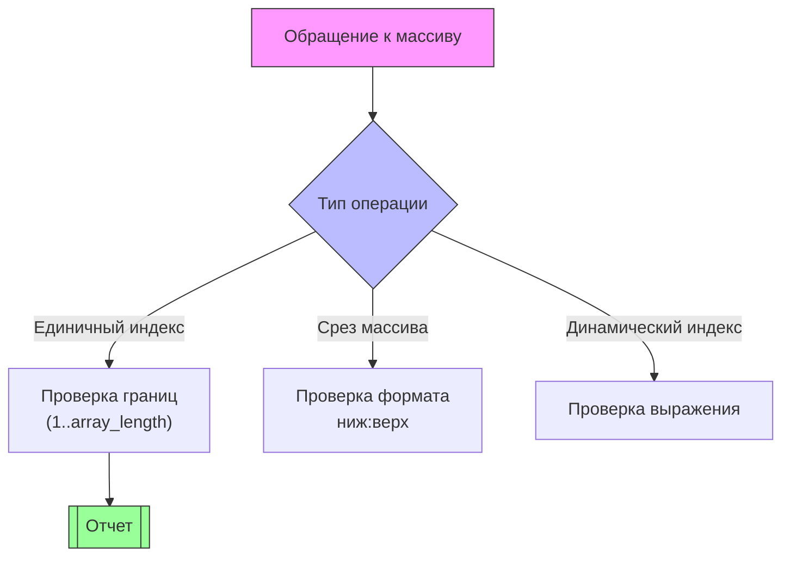

# Правило анализа индексов массивов (`A_Indices.java`)

## Содержание
1. [Назначение](#назначение_A_Indices)
2. [Техническая реализация](#техническая-реализация_A_Indices)
3. [Обнаруживаемые проблемы](#обнаруживаемые-проблемы_A_Indices)
4. [Примеры SQL](#примеры-sql_A_Indices)
5. [Конфигурация](#конфигурация_A_Indices)
6. [Рекомендации](#рекомендации_A_Indices)
7. [Метаданные](#метаданные_A_Indices)

## Назначение <a name="назначение_A_Indices"></a>
Анализирует операции с индексами массивов в PostgreSQL для:
- Проверки выхода за границы массива
- Валидации синтаксиса срезов
- Оптимизации доступа к элементам
- Контроля типов индексов

```sql
-- Примеры анализируемых конструкций
SELECT array_col[1] FROM table;
UPDATE items SET tags[2] = 'new' WHERE id = 1;
```
## Техническая реализация <a name="техническая-реализация_A_Indices"></a>
###Класс-визитор ANTLR4

```java
public class A_Indices extends PostgresParserBaseVisitor<Void> {
    @Override
    public Void visitA_Indices(A_IndicesContext ctx) {
        // Проверка индексов
        checkIndexBounds(ctx);
        
        // Проверка срезов
        if (ctx.slice != null) {
            checkSliceSyntax(ctx);
        }
        
        // Проверка типа индекса
        checkIndexType(ctx);
        
        return super.visitA_Indices(ctx);
    }
    
    private void checkIndexBounds(A_IndicesContext ctx) {
        if (ctx.index instanceof NumberLiteralContext) {
            int index = Integer.parseInt(((NumberLiteralContext)ctx.index).getText());
            if (index < 1) {
                reportIssue(ctx, "Индекс массива не может быть меньше 1");
            }
        }
    }
}
```
## Обнаруживаемые проблемы <a name="обнаруживаемые-проблемы_A_Indices"></a>
1. Выход за границы массива  
Код ошибки: `ARRAY_INDEX_OUT_OF_BOUNDS`

Пример:

```sql
SELECT arr[0] FROM table;  -- Индексация начинается с 1
```
2. Некорректные срезы  
Код ошибки: `ARRAY_INVALID_SLICE`

Пример:

```sql
SELECT arr[1:0] FROM table;  -- Неверный порядок границ
```
3. Неоптимальные операции  
Код ошибки: `ARRAY_INEFFICIENT_OPERATION`

Пример:

```sql
SELECT arr[array_length(arr,1)] FROM table;  -- Избыточный расчет
```
4. Небезопасное приведение типов  
Код ошибки: `ARRAY_UNSAFE_CAST`

Пример:

```sql
SELECT (arr::text[])[1] FROM jsonb_array;  -- Потеря типизации
```
## Примеры SQL <a name="примеры-sql_A_Indices"></a>
### ❌ Проблемные запросы

```sql
-- 1. Отрицательный индекс
UPDATE users SET preferences[-1] = true;

-- 2. Некорректный срез
SELECT logs[10:5] FROM sessions;

-- 3. Неоптимальный доступ
SELECT items[array_upper(items, 1)] FROM orders;
```
### ✅ Рекомендуемые исправления

```sql
-- 1. Корректный индекс
UPDATE users SET preferences[1] = true;

-- 2. Правильный срез
SELECT logs[5:10] FROM sessions;

-- 3. Оптимизированный доступ
SELECT items[cardinality(items)] FROM orders;
```
## Конфигурация <a name="конфигурация_A_Indices"></a>
### Настройки в SonarQube

```yaml
postgres:
  array_indexing:
    check_bounds: true
    max_index_value: 1000000
    check_slice_syntax: true
    unsafe_cast_warning: true
```
### Параметры анализатора

```java
ArrayIndexAnalyzer.newBuilder()
    .withBoundsChecking(true)
    .withSliceValidation(true)
    .withMaxIndexValue(1_000_000)
    .build();
```
## Рекомендации <a name="рекомендации_A_Indices"></a>
1. Для работы с индексами:

```sql
-- Вместо:
SELECT array_element(arr, 1);

-- Используйте:
SELECT arr[1];
```
2. Для безопасных срезов:

```sql
-- Вместо:
SELECT arr[start:end] FROM table;

-- Лучше:
SELECT arr[
    greatest(1, start):
    least(array_length(arr, 1), end)
] FROM table;
```
3. Для проверки существования:

```sql
-- Вместо:
SELECT arr[index] IS NOT NULL;

-- Используйте:
SELECT index BETWEEN 1 AND array_length(arr, 1);
```
## Метаданные <a name="метаданные_A_Indices"></a>
|Свойство|Значение
|-|-
|Идентификатор|postgres:array-index-analysis
|Категория|Надежность
|Время исправления|15 минут
|Теги|sql, arrays, performance
|Тип|Bug/Code Smell

### Дополнительные возможности:
Анализ производительности:

```java
if (isNestedArrayAccess(ctx)) {
    reportPerformanceIssue(ctx, "Вложенное обращение к массиву");
}
```
Проверка NULL-безопасности:

```java
if (!isNullSafeAccess(ctx)) {
    reportIssue(ctx, "Возможен NULL при обращении");
}
```
Валидация типов:

```java
if (!isIndexTypeValid(ctx)) {
    reportTypeError(ctx, "Некорректный тип индекса");
}
```